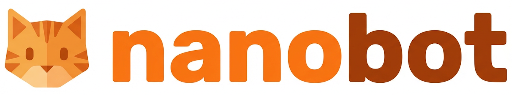

  
  <h1>emoticorebot</h1>
  
Ultra-lightweight personal AI assistant with a fusion pipeline architecture (IQ + EQ), derived from Nanobot.

  

    
    
    
    
  

## Language

- 中文文档: `README.zh-CN.md`
- English: `README.en.md`

## Quick Links

- Install & quick start: `README.en.md#install`
- 架构与目录: `README.zh-CN.md#架构`
- Community: `COMMUNICATION.md`

## Notes

- Current implementation has migrated to the fusion pipeline and layered memory architecture.
- Legacy split-route modules (`router.py`, `agent/flows/`, old `agent` memory modules) have been removed.

